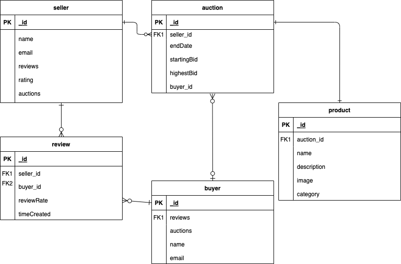

# Auctioning

## [Figma](https://www.figma.com/file/etehEf37snJHK29pFlbwMn/Untitled?type=design&node-id=0%3A1&mode=design&t=L8fJVCtUW17XKV8c-1)

A trello board was used to keep track of development progress and can be viewed [Trello](https://trello.com/b/9r5xdcug/auctionwebsite)

The project itself was deployed and can be viewed [here]()

## Overview  

We are in the process of developing an auction website where numerous sellers can list their products for bidding. Users will have the opportunity to place bids on these items within a specified time frame. At the End of the auction period, the product will be awarded to the bidder with the highest offer. 

## Technologies used   
  - express
  - mongoose
  - ejs
  - dotenv
  - passport-Google-Oauth
  - passport
  - express-session
  - method-override
  - Script.js
  - style.css
  - morgan 

## Entity Relationship Diagram

## Requirements 
- AAU-Buyer, in the product details page I want to be able to click on the product the seller's name to see their account
---
- AAU, in the home page I want to view the 10 most recent products uploaded
---
- AAU, I want to be able to sign in to my account
---
- AAU, I want to be able to sign out of my account
---
- AAU-Seller, I want to be able to upload products to the website
---
- AAU, in the home page I want to be able to click on a product to see its' details
---
- AAU, in the product details page I want to be able to see the product's image, name, highest bid, details, and seller name
---
- AAU, in the product details page I want to be able to click on the seller name and then see their details (even if i am the seller)
---
- AAU, in the categories page I want to be able to view all of the product categories the website has
---
- AAU, in the categories page I want to be able to click on one of the categories and be taken to another page that contains all of the products of that category
---
- AAU, in the categories page I want to be able to search for products using their product name
---
- AAU, in the account page I want to be able to view my name, ongoing auctions, closed auctions, and description (buyer or seller)
---
- AAU-Seller, in the product details page i want to be able to click on an edit button to update product name, duration, image, and description
---
- AAU-Seller, in the product details page i want to be able to click on a delete button to delete the product
---
- AAU-Buyer, in the product details page i want to be able to place a price higher than the current price and bid
---
- AAU, in the product details page i want to see the time left until the auction ends
---
- AAU-Seller, in the account page I want to be able to see the reviews people had about me and my rating (0/5)
---
- AAU-Seller, in the account page the ongoing auctions and closed auctions are products that I uploaded.
---
- AAU-Buyer, in the account page the ongoing auctions and closed auctions are products that I have the highest bid in.
---
- AAU-Buyer, in the account page I want to be able to see the sellers i have reviewed and click on their name to view their account.
---
- AAU-Seller, in the product details page I want to be able to click on the highest bid user to see their account.

